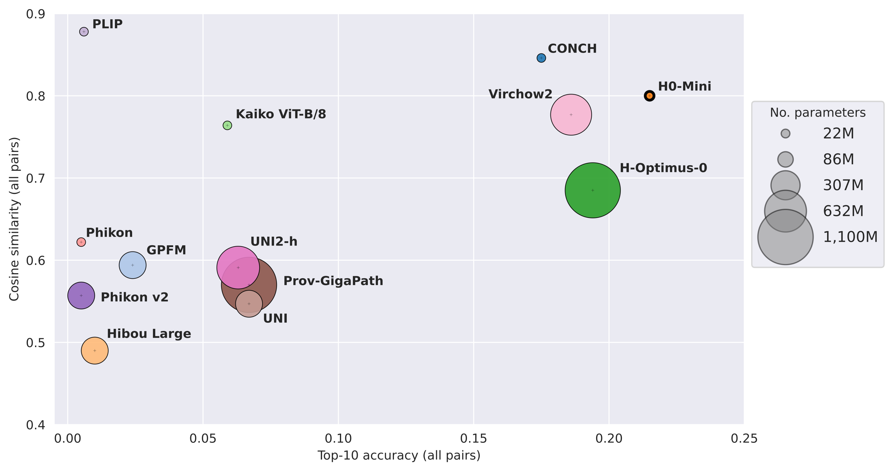

<div align="center">


[](https://github.com/owkin/plism-benchmark/actions/workflows/python-app.yml) [](https://github.com/owkin/plism-benchmark/actions/workflows/page.yml) [](https://arxiv.org/abs/2501.16239)
[](https://huggingface.co/datasets/owkin/plism-dataset)
</div>


## Documentation

The documentation can be found [here](https://owkin.github.io/plism-benchmark).
Please refer to the Installation section to install this repository.

## Benchmark

On 03/03/2025.

| Extractor      |   Cosine similarity (all) |   Top-10 accuracy (cross-scanner) |   Top-10 accuracy (cross-staining) |   Top-10 accuracy (cross-scanner, cross-staining) |   Leaderboard metric | Rank   |
|:---------------|--------------------------:|----------------------------------:|-----------------------------------:|--------------------------------------------------:|---------------------:|:-------|
| H0-Mini        |                     0.800 |                             0.864 |                              0.318 |                                             0.183 |                0.541 | #1     |
| CONCH          |                     0.846 |                             0.752 |                              0.241 |                                             0.155 |                0.498 | #2     |
| H-Optimus-0    |                     0.685 |                             0.744 |                              0.327 |                                             0.166 |                0.480 | #3     |
| Virchow2       |                     0.777 |                             0.609 |                              0.306 |                                             0.163 |                0.464 | #4     |
| Prov-GigaPath  |                     0.570 |                             0.592 |                              0.118 |                                             0.054 |                0.333 | #5     |
| UNI2-h         |                     0.591 |                             0.501 |                              0.190 |                                             0.046 |                0.332 | #6     |
| Kaiko ViT-B/8  |                     0.764 |                             0.346 |                              0.147 |                                             0.045 |                0.325 | #7     |
| UNI            |                     0.547 |                             0.532 |                              0.169 |                                             0.053 |                0.325 | #8     |
| GPFM           |                     0.594 |                             0.356 |                              0.092 |                                             0.017 |                0.265 | #9     |
| PLIP           |                     0.878 |                             0.054 |                              0.040 |                                             0.004 |                0.244 | #10    |
| Phikon         |                     0.622 |                             0.125 |                              0.021 |                                             0.004 |                0.193 | #11    |
| Kaiko ViT-L/14 |                     0.569 |                             0.115 |                              0.041 |                                             0.006 |                0.183 | #12    |
| Phikon v2      |                     0.557 |                             0.064 |                              0.030 |                                             0.003 |                0.164 | #13    |
| Hibou Large    |                     0.490 |                             0.061 |                              0.030 |                                             0.008 |                0.147 | #14    |                                       0.008 |                0.147 | #14    |

Our robustness benchmark is based on two different metrics: top-10 accuracy and cosine similarity. These metrics are computed over 4,095 unique slide pairs. Through our evaluation pipeline, robustness metrics are computed for all pairs but also cross-scanner (fixed staining), cross-staining (fixed scanner) or cross-scanner and cross-staining. Details are available in the `results.csv` file generated as the end of the evaluation.

We plan to udpate this benchmark regularly with the latest extractors. Feel free to submit a PR sharing your results with your own feature extractor (see contribution guidelines).

> [!IMPORTANT]
> The leaderboard metric is the average of 4 metrics: median cosine similary for all pairs, median cross-scanner top-10 accuracy, median cross-staining top-10 accuracy, median cross-scanner and cross-staining top-10 accuracy. Median is computed over each corresponding slide pairs (e.g. for cross-scanner, slide pairs with different scanner each but common staining).



### Run PLISM benchmark with your model

The following commands can be run through the cli command `plismbench`.
You can find a detailed description of each subcommand by typing:

```bash
plismbench --help
```

### Hardware requirements

This benchmark can be executed on cpu or gpu. We strongly advise to run it on gpu to benefit from `cupy` acceleration on graphical cards. From downloading to computing the results, running the benchmark takes approximately on our workstation (**32 CPUs, 1 Nvidia T4 (16Go) and 120Gb RAM**):

_With storage do disk_

- 2h45 for a ViT-B: 15 minutes for download, 1h30 for features extraction, 1h for robustness metrics computation.
- 4h45 for a ViT-g: 15 minutes for download, 3h for features extraction, 1h30 for robustness metrics computation.

_Without storage do disk_

- 3h30 for a ViT-B: 2h30 for features extraction, 1h for robustness metrics computation.
- 6h30 for a ViT-g: 5h for features extraction, 1h30 for robustness metrics computation.


### [Optional] Download

**If you don't have 250Go available to store PLISM dataset to disk, we advise you to perform the features extraction by streaming images on the fly (see next section). In that case, you can skip this section.**

First you will need to download [PLISM dataset](https://huggingface.co/datasets/owkin/plism-dataset) hosted on Hugging Face using the following command:

```bash
plismbench download --download-dir /your/download/dir --token your_hf_token --workers 8
```

> [!NOTE]
> 225 Go are required to store 91 WSI-level .h5 files, download approximately takes 10 minutes (32 workers)
>

### Features extraction

Please follow these next steps:

0. Let's set `org=your_company_or_group_name`
1. Implement your model in ``plismbench/models/org.py``
2. Add it to the ``plismbench.models.__init__.py`` enum
3. Add related test in ``tests/models/test_org.py``
4. Perform features extraction using the following script (example with `H0_mini`):

```bash
plismbench extract \
    --extractor h0_mini \
    --batch-size 8 \
    --export-dir /your/features/export/dir/ \
    --download-dir /the/previous/download/dir/ \
    --workers 8
```

The output features directory will automatically be set to `export_dir/extractor`.

**Specify ``--streaming`` if you want to perform the download of images on the fly without storing to disk.**


> [!NOTE]
> 10 Gb storage and 1h30 are necessary to extract all features with a ViT-B model, 16 CPUs and 1 Nvidia T4 (16Go). 2h30 are necessary if streaming mode is enabled.
>

> [!IMPORTANT]
> If your model aims to be integrated into `plismbench`, prior tests will be conducted on CI/CD which requires a login step to Hugging Face. This step will call `secrets.HF_TOKEN`, i.e. the HF token of the CODEOWNER of this repository.

> ```yaml
>     - name: Log in to Hugging Face
>        run: python -c "from huggingface_hub import login; login(token='${{ secrets.HF_TOKEN }}', new_session=False)"
>```
> Please make sure that 1) your model is public, 2) the CODEOWNER has access to it. For instance, if your model is publicly available on HF but under gated access, please check with the CODEOWNER to be granted access to it (you can ask it through your PR). **We only benchmark public models.**

### Compute metrics

Simply run (example with `H0_mini`):

```bash
plismbench evaluate \
    --extractor h0_mini \
    --features-dir /your/features/previous/export/dir/ \
    --metrics-dir /your/metrics/export/dir/
```

The input features directory will automatically be set to `export_dir/extractor`.

> [!NOTE]
> 1h is necessary to compute metrics for a ViT-B model, 16 CPUs and 1 Nvidia T4 (16Go).
>


Note that the `evaluate` pipeline runs regardless of the models registered in ``plismbench.models.__init__.py``. The only requirement is to store your model features inside `/your/features/previous/export/dir/` under the `extractor` folder (e.g. `your/features/previous/export/dir/h0_mini/`).

The `evaluate` command can run on two different types of device:

- `--device="cpu"` (uses `numpy`): in that case, please specify a number of `--workers`. Metrics computation will be parallelized over all possible slide pairs. **Depending on your RAM, setting a too high number of workers will cause memory errors**. Indeed, if `n_tiles=8139` and `workers=32` then 32 matrices of shape (8139, d) will be stored to RAM, then 32 matrices of shape (16278, 16278) to compute top-k accuracies as it requires to compute dot products between slide A and slide B. Please lower the number of workers if you encounter RAM issues.
- `--device="gpu"` (uses `cupy`): in that case, no need to specify the number of workers. Matrix operations are done on the gpu directly in a sequential manner over all possible slide pairs. **Depending on your GPU RAM, you may encounter cuda memory errors**. We advise to switch to CPU in that case. As an example, we manage to run `evaluate` on GPU (1 T4 16 Go) with Virchow2 concatenated features (d=2563) and `n_tiles=8139` (1 hour).


> [!IMPORTANT]
> The `evaluate` command will compute metrics for each slide-pair (individual pickles and a final .csv with 1 row per pair) and metrics aggregated over pairs (.csv file). Metrics are cosine similarity and top-k accuracies (with k=[1, 3, 5, 10]) by default. We compute mean (std) and median (iqr) over all possible slides pairs, inter-scanners pairs, inter-stainings pairs and inter-scanners + inter-staining pairs.
>
> The number of tiles can be set to either 460 (debugging purposes), 2713 (1/6th of the total number of tiles per slide which is 16278), 5426 (1/3rd), 8139 (half) or 16278 (total number of tiles). **If `None`, the default number of tiles will be 8139 which is the reference for our benchmark.**

### Get your results

By default, results are available at `/your/metrics/export/dir/8139_tiles/your_extractor/results.csv`. Here is an example with `H0_mini` on a subset of 460 tiles. For each type of robustness and metrics, we report `mean (std) ; median (iqr)`.

|                               | cosine_similarity             | top_1_accuracy                | top_3_accuracy                | top_5_accuracy                | top_10_accuracy               |
|:------------------------------|:------------------------------|:------------------------------|:------------------------------|:------------------------------|:------------------------------|
| inter-scanner                 | 0.914 (0.051) ; 0.923 (0.056) | 0.673 (0.255) ; 0.701 (0.433) | 0.781 (0.213) ; 0.835 (0.307) | 0.823 (0.193) ; 0.882 (0.251) | 0.875 (0.162) ; 0.931 (0.173) |
| inter-staining                | 0.769 (0.160) ; 0.830 (0.085) | 0.190 (0.167) ; 0.152 (0.213) | 0.309 (0.218) ; 0.292 (0.307) | 0.372 (0.240) ; 0.374 (0.336) | 0.467 (0.266) ; 0.501 (0.357) |
| inter-scanner, inter-staining | 0.737 (0.156) ; 0.792 (0.106) | 0.104 (0.108) ; 0.072 (0.127) | 0.197 (0.163) ; 0.166 (0.227) | 0.253 (0.190) ; 0.231 (0.274) | 0.346 (0.226) ; 0.346 (0.335) |
| all                           | 0.753 (0.158) ; 0.803 (0.106) | 0.153 (0.194) ; 0.089 (0.166) | 0.251 (0.229) ; 0.195 (0.273) | 0.307 (0.244) ; 0.266 (0.321) | 0.397 (0.265) ; 0.387 (0.373) |

You can generate those results by executing:

```python
from plismbench.utils.metrics import format_results
results = format_results(metrics_root_dir="/path/to/metrics/root_dir/")
```

Please check `notebooks/visualization.ipynb` for details.

### Get leaderboard results


You can generate the leaderboard results from a `metrics.csv` file by using

```python
from plismbench.utils.metrics import get_leaderboard_results
leaderboard_results = get_leaderboard_results(metrics_root_dir="/path/to/metrics/root_dir/")
```

Please check `notebooks/visualization.ipynb` for details.

## Contribute

Please refer to our [documentation](https://owkin.github.io/plism-benchmark) to follow our contribution guidelines.

> [!IMPORTANT]
> Please report the output of `get_leaderboard_results` in your PR description as illustrated above, along with the number of tiles used to compute the metrics.
>

## License

This repository is licensed under [CC BY 4.0 licence](https://creativecommons.org/licenses/by/4.0/deed.en).

## Acknowledgments

We thank PLISM dataset's authors for their unique contribution.

## Third-party licenses

- PLISM dataset (Ochi et al., 2024) is distributed under [CC BY 4.0 license](https://plus.figshare.com/collections/Pathology_Images_of_Scanners_and_Mobilephones_PLISM_Dataset/6773925).
- Elastix (Klein et al., 2010; Shamonin et al., 2014) is distributed under [Apache 2.0 license](https://github.com/SuperElastix/elastix).

## How to cite

If you are using this dataset, please cite the original article (Ochi et al., 2024) and our work as follows:

Filiot, A., Dop, N., Tchita, O., Riou, A., Peeters, T., Valter, D., Scalbert, M., Saillard, C., Robin, G., & Olivier, A. (2025). Distilling foundation models for robust and efficient models in digital pathology. arXiv. https://arxiv.org/abs/2501.16239

or

```
@misc{filiot2025distillingfoundationmodelsrobust,
      title={Distilling foundation models for robust and efficient models in digital pathology},
      author={Alexandre Filiot and Nicolas Dop and Oussama Tchita and Auriane Riou and Thomas Peeters and Daria Valter and Marin Scalbert and Charlie Saillard and Geneviève Robin and Antoine Olivier},
      year={2025},
      eprint={2501.16239},
      archivePrefix={arXiv},
      primaryClass={cs.CV},
      url={https://arxiv.org/abs/2501.16239},
}
```

## References

- (Ochi et al., 2024) Ochi, M., Komura, D., Onoyama, T. et al. Registered multi-device/staining histology image dataset for domain-agnostic machine learning models. Sci Data 11, 330 (2024).


## TODO
- [ ] Add CTransPath
- [ ] Add Lunit-Base
- [ ] Add PLIP
- [ ] Add HIPT tile encoder
- [ ] Add DINO V2 ViT-g pre-trained on ImageNet
